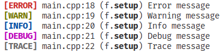
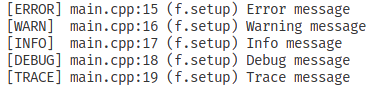
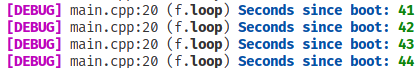

# ArduLog
ArduLog is a simple to use library mean to print log messages to a serial console.
ArduLog supports use of colors by stating `#define ARDULOG_USE_DECORATIONS 1` before importing ArduLog.h

## With decorators

## Without decorators

# Use colors in your own messages
It is possible to use colors in your own log messages by using one of the defined colors.  
For example, using `LOG_DEBUG(LOG_BLUE, "Seconds since boot: ", LOG_GREEN, millis() / 1000);` would show

## Available decorators
* LOG_BOLD
* LOG_BLACK
* LOG_RED
* LOG_GREEN
* LOG_YELLOW
* LOG_BLUE
* LOG_MAGENTA
* LOG_CYAN
* LOG_LIGHT_GRAY
* LOG_GRAY
* LOG_WHITE
* LOG_RESET_COLOR
